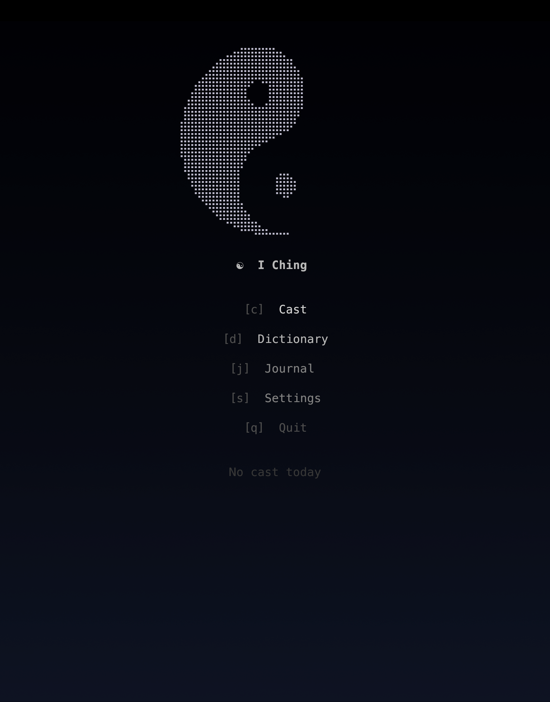

# iching

A contemplative I Ching TUI for the terminal.

<p align="center">
  
</p>

Set an intention. Cast a hexagram. Sit with what shows up.

## What it does

- **Cast** with an optional intention. The casting ritual unfolds as an
  animation — three coins, six lines, then the hexagram rendered as a
  large braille glyph.
- **Browse** all 64 hexagrams with classical Chinese commentary
  (大象傳, 彖傳), English image and judgment, and Wilhelm-inspired notes.
- **Journal** every cast (with timestamp and intention) in
  append-only JSONL — your own divination history.
- **Hook into LLMs** the assistant can read your cast for further interpretation.

Raw ANSI, five hand-tuned themes (ink, bone, cinnabar, jade, river),
four glyph-reveal animations, three Chinese fonts.
No web technologies, no frameworks.

## Install

Requires [Bun](https://bun.sh) >= 1.0.

```bash
git clone https://github.com/pro-vi/iching.git
cd iching
bun install
bun run build         # builds dist/iching for your platform
```

Or run directly without building:

```bash
bun apps/cli/src/main.ts
```

## Usage

```bash
iching                          # interactive TUI
iching cast                     # one-shot cast (plain text)
iching cast "should I ship?"    # with a question
iching cast --json              # structured output
iching journal list             # recent readings
iching journal show today       # today's reading
iching hexagram 1               # look up hexagram by number
iching dict                     # browse all 64 in TUI
iching config theme cinnabar    # set theme
```

Press `c` to cast, `j` for journal, `d` for dictionary, `s` for
settings, `q` to quit.

## Storage

Files follow the [XDG Base Directory](https://specifications.freedesktop.org/basedir-spec/) spec:

| File | Path | Purpose |
|------|------|---------|
| Cache | `~/.cache/iching/daily-cache.json` | Most recent cast |
| Journal | `~/.local/state/iching/history.jsonl` | All casts |
| Config | `~/.config/iching/config.json` | Theme, motion, glyph settings |

Override with `ICHING_HOME` env var or `--data-dir` flag.

## Architecture

Bun workspace monorepo. Four packages:

| Package | Responsibility |
|---------|----------------|
| `@iching/core` | Pure domain — casting, derivation, hexagram data |
| `@iching/storage` | File persistence (JSON, JSONL, XDG paths) |
| `@iching/terminal` | TUI rendering — scenes, animation, themes (raw ANSI) |
| `@iching/cli` | Commander-based entry point, hook adapter |

## Development

```bash
bun test          # run tests (382 tests, ~100ms)
bun run typecheck # tsc --noEmit
bun run smoke     # end-to-end smoke test
```

## Why

The cast is true. If true, the hexagram is already everywhere in the
day — the project, the conversation, the code, the decisions. It isn't
a message to decode. It's a lens already present.

Observe. Don't interpret.

## License

MIT
